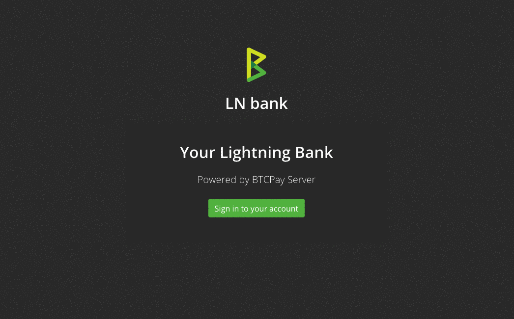

# LN bank

An extension for [BTCPay Server](https://github.com/btcpayserver) to use the BTCPay Lightning node in custodial mode.
It allows server admins to open up the internal LN node and give users access via custodial layer 3 wallets.

